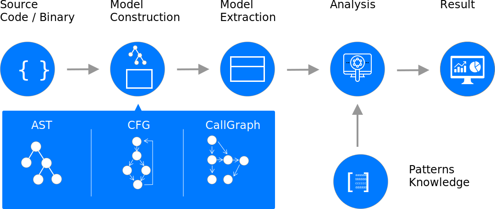
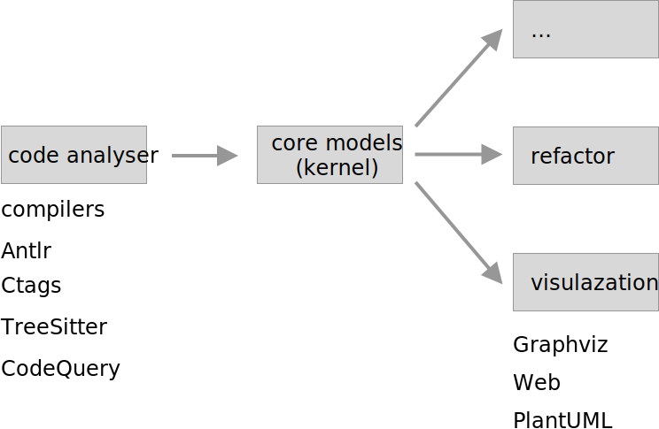

# Kernel

the design principles of new modernizing toolsets

Kernel Tools

## Todo

- [ ] generate core model code (Java, Rust, Golang...) from code protocol
- [ ] pipeline architecture of system
   - [ ] code analysis: unique output  (Antlr, Ctags, TreeSitter...)
   - [ ] code results: code analysis by cases (test bad smells...)
   - [ ] code visual: visual with dependences (graphviz, plantuml...)
   - [ ] code visual online: visual with web (D3.js or ArchGuard web...)
   - [ ] auto refactoring: by cases
   - [ ] architecture guarding...
- [ ] CLI design?

## Structs design 

based on [MIR](https://github.com/vnmakarov/mir) design

* MIR consists of **modules**
  * Each module can contain **functions** and some declarations and data
  * Each function has **signature** (parameters and return types), **local variables**
    (including function arguments) and **instructions**
    * Each local variable has **type** which can be only 64-bit integer, float, double, or long double
    * Each instruction has **opcode** and **operands**
      * Operand can be a local variable
        (or a function argument), **immediate**, **memory**, **label**, or **reference**
        * Immediate operand can be 64-bit integer, float, double, or long double value
    * Memory operand has a **type**, **displacement**, **base** and **index** integer local variable,
      and integer constant as a **scale** for the index
      * Memory type can be 8-, 16-, 32- and 64-bit signed or unsigned integer type,
        float type, double, or long double type
        * When integer memory value is used it is expanded with sign or zero promoting
          to 64-bit integer value first
    * Label operand has name and used for control flow instructions
    * Reference operand is used to refer to functions and declarations in the current module,
      in other MIR modules, or for C external functions or declarations
  * opcode describes what the instruction does
  * There are **conversion instructions** for conversion between different
    32- and 64-bit signed and unsigned values, float, double, and long double values
  * There are **arithmetic instructions** (addition, subtraction, multiplication, division,
    modulo) working on 32- and 64-bit signed and unsigned values, float, double, and long double values
  * There are **logical instructions** (and, or, xor, different shifts) working on
    32- and 64-bit signed and unsigned values
  * There are **comparison instructions**  working on 32- and 64-bit
    signed and unsigned values, float, double, and long double values
  * There are **branch insns** (unconditional jump, and jump on zero or non-zero value)
    which take a label as one their operand
  * There are **combined comparison and branch instructions** taking a label as one operand
    and two 32- and 64-bit signed and unsigned values, float, double, and long double values
  * There is **switch** instruction to jump to a label from labels given as operands depending on index given as the first operand
  * There are **function and procedural call instructions**
  * There are **return instructions** working on 32- and 64-bit
    integer values, float, double, and long double values
